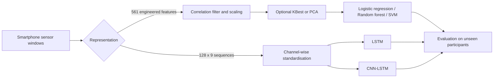

# Human Activity Recognition from Smartphone Signals

An end-to-end machine-learning project that classifies six daily activities from smartphone accelerometer and gyroscope data. I compared classical models trained on engineered signal features with sequence models trained directly on multichannel sensor windows, while keeping participants separate during validation to measure generalisation to unseen people.

The project demonstrates signal-data exploration, leakage-safe preprocessing, grouped model selection, deep-learning architecture comparison, participant-level evaluation, and reproducible result tracking.

## Project overview

**Task:** multiclass time-series classification  
**Dataset:** [UCI Human Activity Recognition Using Smartphones](https://doi.org/10.24432/C54S4K)  
**Activities:** walking, walking upstairs, walking downstairs, sitting, standing, and laying  
**Data:** 10,299 windows from 30 participants  
**Best observed test result:** 94.47% accuracy and 0.9446 macro-F1 with logistic regression  
**Validation-selected model:** linear SVM with 93.65% test accuracy and 0.9354 macro-F1

## What the signal data represents

Participants wore a Samsung smartphone at the waist while performing the six activities. The sensors were sampled at 50 Hz. Each example is a 2.56-second window containing 128 time steps, with 50% overlap between consecutive windows.

Each sequence has nine channels:

| Signal | Axes | Meaning |
|---|---|---|
| Body acceleration | x, y, z | Motion-related acceleration after separating the gravity component |
| Body gyroscope | x, y, z | Angular velocity describing rotation around each axis |
| Total acceleration | x, y, z | Overall acceleration, including body motion and gravity |

The dataset supports two complementary representations:

- **Engineered features:** 561 time- and frequency-domain measurements supplied with the dataset, including statistics, magnitudes, correlations, jerk signals, spectral measures, and orientation-related values.
- **Sensor sequences:** arrays with shape `128 × 9`, used by the LSTM and CNN-LSTM to learn temporal patterns directly.

In this project, “raw signals” means the filtered and windowed sequences supplied by UCI before my project-level standardisation. I did not collect the sensor recordings or claim the dataset provider's filtering as original work.

## Methodology



### 1. Data validation and exploration

I first checked shapes, labels, missing and infinite values, feature names, subject counts, and separation between the official training and test participants. I then explored the signal data using:

- activity and participant distributions;
- example acceleration windows and RMS signal intensity;
- Welch power spectra to compare activity frequencies;
- correlation analysis across the 561 engineered features;
- PCA and t-SNE for lower-dimensional views;
- K-means to compare natural clusters with activity labels; and
- Isolation Forest to inspect unusual windows without automatically removing them.

The exploration showed a clear distinction between dynamic and stationary activities. Laying was strongly associated with orientation, while sitting and standing overlapped and remained the hardest pair to distinguish.

### 2. Leakage-safe classical machine learning

The official training set contains 7,352 windows from 21 people; the test set contains 2,947 windows from nine different people. Because many overlapping windows come from the same person, random row-level cross-validation would produce an overly optimistic estimate.

I therefore used five stratified, participant-grouped folds. Every preprocessing operation was fitted only on the fitting participants within each fold:

1. remove one of each pair of features with absolute correlation above 0.90;
2. standardise features where required;
3. optionally apply ANOVA KBest with 20 or 50 features, or PCA retaining 90% or 95% variance;
4. tune logistic regression, random forest, linear SVM, and RBF SVM; and
5. select the configuration with the highest mean macro-F1.

Correlation filtering reduced the complete training representation from 561 to 202 features. Further PCA or KBest reduction did not improve grouped-validation performance. The predefined selection rule chose a linear SVM with `C=0.1`.

### 3. Sequence modelling

For deep learning, I used the `128 × 9` sensor windows and calculated channel means and standard deviations using fitting participants only.

- **LSTM:** compared one- and two-layer recurrent networks, with batch normalisation, dropout, regularisation, Adam, and early stopping.
- **CNN-LSTM:** used three 1D convolutional layers to detect local movement patterns, max pooling to shorten the sequence, and an LSTM to model their temporal order.

Neural architecture selection used 15 fitting participants and six validation participants. I selected settings using validation prediction cross-entropy, then reinitialised each chosen model and trained it on all 21 training participants for the selected number of epochs.

### 4. Evaluation

I reported accuracy and macro-F1, plus confusion matrices and per-participant metrics. Macro-F1 gives equal importance to every activity rather than allowing larger classes to dominate the result.

Since neighbouring windows overlap, I estimated uncertainty by bootstrapping complete test participants rather than treating individual windows as independent observations. Saved predictions and SHA-256 fingerprints connect each result to the exact dataset, notebook code, and shared evaluation code used for the run.

## Results

| Model | Input | Test accuracy | Macro-F1 | Role |
|---|---|---:|---:|---|
| Logistic regression | Engineered features | **94.47%** | **0.9446** | Interpretable comparison |
| RBF SVM | Engineered features | **94.47%** | 0.9438 | Nonlinear comparison |
| Linear SVM | Engineered features | 93.65% | 0.9354 | Selected by grouped CV |
| CNN-LSTM | Sensor sequences | 92.67% | 0.9281 | Best sequence model |
| LSTM-64-48 | Sensor sequences | 91.18% | 0.9119 | Recurrent baseline |

The classical models remained strongest on this benchmark. This suggests that the supplied engineered time- and frequency-domain features already capture much of the useful structure in the signals. The CNN-LSTM improved on the standalone LSTM, showing that local convolutional pattern extraction helped before temporal modelling.

Across model families, sitting and standing caused the most errors. These activities have similarly low movement intensity and differ mainly through posture and phone orientation. Results also varied meaningfully between participants, which is why the subject-aware evaluation is central to this project.

Detailed metrics and uncertainty intervals are available in [RESULTS.md](RESULTS.md).

## What I built

- A validated data contract for engineered features, raw windows, labels, and subject IDs.
- A participant-aware experimental design that prevents the same person appearing in fitting and validation data.
- Reusable scikit-learn preprocessing and model-selection pipelines.
- Keras LSTM and PyTorch CNN-LSTM training workflows.
- Signal-focused EDA covering time, frequency, dimensionality, clustering, and outliers.
- Auditable evaluation with per-subject scores, whole-participant bootstrap intervals, saved predictions, and source fingerprints.
- Automated notebook execution, result summarisation, submission export, and pipeline tests.

## Repository structure

```text
.
├── archive (1)/
│   ├── HAR.ipynb             # EDA and classical machine-learning workflow
│   ├── NN.ipynb              # LSTM and CNN-LSTM workflow
│   └── har_data.npz          # Engineered features and sensor windows
├── artifacts/                # Metrics and row-level predictions
├── scripts/                  # Notebook runner, summaries, and export tools
├── tests/                    # Data-contract and evaluation tests
├── har_pipeline.py           # Shared loading, validation, and preprocessing
├── har_evaluation.py         # Participant-aware metrics and provenance
├── RESULTS.md                # Reproduced benchmark table
├── requirements.txt
└── environment.yml
```

## Run the project

Python 3.11 was used for the verified runs.

```bash
python3.11 -m venv .venv
source .venv/bin/activate
python -m pip install -r requirements.txt
python -m ipykernel install --user --name har-lstm --display-name "Python (har-lstm)"
```

Execute the classical notebook before the neural notebook because the final comparison reads the current classical results:

```bash
python scripts/run_notebooks.py
python scripts/summarize_results.py
```

Run the automated checks with:

```bash
python -m unittest discover -s tests -v
```

The notebooks can take tens of minutes on a CPU. Set `HAR_DATA_FILE` if `har_data.npz` is stored outside the default project directories.

## Limitations and next steps

- The official test set contains only nine people, so participant-level uncertainty remains wide.
- The test set was inspected during earlier development; reported values are reproducible benchmark measurements rather than performance on a fresh external holdout.
- The controlled data uses one waist-mounted phone position. Performance has not been established for other devices, carrying positions, or real-world conditions.
- The dataset contains no fall class, so this is an activity classifier and not a validated fall detector.
- Classical and neural workflows used different selection designs and tuning budgets, so their scores compare complete workflows rather than isolating model architecture alone.

A production-oriented continuation would evaluate locked models on newly collected participants, repeat neural training across seeds and participant splits, test different phone positions, investigate probability calibration, and measure inference latency and battery cost on a mobile device.

## Tools and skills demonstrated

Python, NumPy, pandas, SciPy, scikit-learn, TensorFlow/Keras, PyTorch, signal processing, time-series classification, grouped cross-validation, feature selection, PCA, t-SNE, clustering, outlier analysis, hyperparameter tuning, model interpretation, statistical evaluation, and reproducible ML workflows.

## Author

**Deepak Kushwaha**  
Data Mining & Machine Learning project
